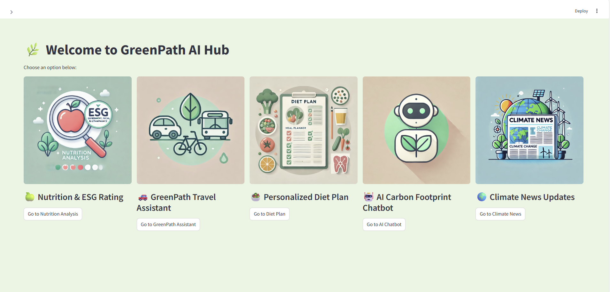

# 🌱 AI-Powered Carbon Footprint Tracker

An AI-enabled web application that helps users estimate and reduce their carbon footprint based on daily transportation choices. The app calculates CO₂ emissions from real-time travel distance and provides intelligent, personalized suggestions for greener alternatives.

---

## 🚀 Features

- 🔍 **Real-time distance tracking** using OpenStreetMap and geopy
- ♻️ **Carbon footprint estimation** for different transport modes (car, bus, train, etc.)
- 🧠 **AI-based emission reduction suggestions** tailored to user behavior
- 💻 **Streamlit web interface** for a clean, user-friendly experience
- 🔐 Secure use of **environment variables** for API keys and config

---

## 📸 Demo Screenshot

---
